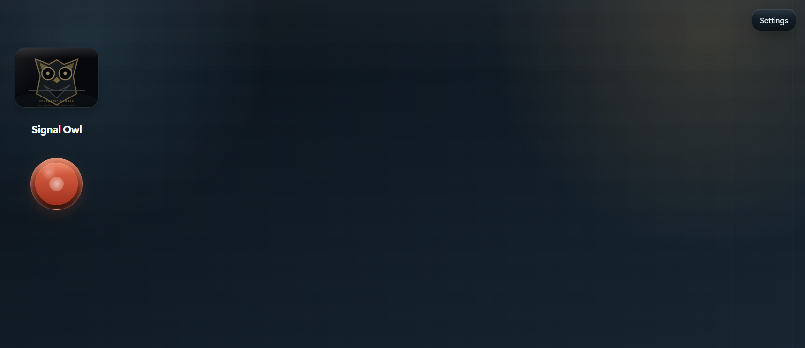

# Animal Audio Playground

A local-first museum sound wall for exploring animal calls, short science stories, and exhibit input hardware—published with a synthetic sample instead of real recordings.



The visible experience is intentionally simple: choose an animal, press or hold one substantial control, and hear the result immediately. Under that calm surface is a configurable Electron exhibit system with multiple languages, controller mappings, guessing mode, content editors, and optional recording workflows.

## Start here

Requirements: Node.js 22.12 or newer and Windows, macOS, or Linux supported by Electron.

```powershell
npm ci
npm run sample:generate
npm start
```

On Windows, `Launch Museum Ready App.cmd` is available after `npm ci`.

The public clone opens with **Signal Owl**, a fictional card whose SVG and WAV are generated by this repository. No photographed animal, field recording, narrator, visitor, or child appears in the sample.

## What the exhibit can do

- Present a high-contrast wall of animal cards in touchscreen or simplified museum-display mode.
- Play overlapping press-and-hold clips with configurable attack, release, looping, and gain.
- Pair a primary call with optional narrated facts and a longer animal-information view.
- Map keyboard keys, arcade switches, and controller buttons to exhibit actions.
- Switch among English, Spanish, French, and Chinese interface text.
- Run a sound-guessing activity that returns to the calm main wall after inactivity.
- Edit animal metadata, facts, crop positions, media references, and app settings locally.
- Record or import content on an exhibit machine when the institution has an approved consent and rights workflow.

## The public sample is a contract

Real content is private by default. `.gitignore` excludes every animal folder except `_template` and `sample-owl`; `npm run check` inspects the staged Git index and fails if an unapproved animal file, visitor-recording path, identity-bearing filename, or raw MP3/MP4/WebM-style asset is about to enter public history.

Read [the sample-media contract](animals/README.md) before adding content. In brief:

- keep field recordings, photos, video, narration, and visitor copies outside this public repository;
- document redistribution rights before publishing any asset;
- obtain explicit adult consent—and parent or guardian approval for minors—before retaining identifiable voices;
- never put names, ages, schools, locations, or other personal details in filenames or public metadata;
- define who reviews recordings, where they live, and when they are deleted.

The sample recorder is disabled. The recording code remains available for controlled local installations, but recording is not a casual default and the application does not provide cloud storage, consent management, or automatic redaction.

## Content layout

```text
animals/
  _template/                  generic schema examples
  sample-owl/                 public synthetic fixture
    sample-owl.animal.md      card, controls, and clip settings
    sample-owl.about.md       facts and interpretation text
    sample-owl.image.svg      generated vector image
    audio/sample-owl-call.wav generated tone, not a recording
config/app-settings.md        wall mode, language, gain, and input mappings
electron/                     secure window, IPC, and filesystem layer
renderer/                     wall, editors, recorder, and information views
tools/                        sample generator and publication checks
```

Each real animal normally has a matching `.animal.md` file, `.about.md` file, image, and audio directory. Optional video, narrated facts, archives, and guest recordings stay local.

## Visible system state

The interface shows which sound is active, when content is loading, which input is mapped, and whether guessing mode is running. Audio uses short fades instead of abrupt starts and stops. Settings are explicit files, so staff can inspect and recover a configuration without reverse-engineering a database.

## Checks

```powershell
npm run sample:generate
git add -- .
npm run check
```

`npm run check` performs syntax checks across the Electron and renderer source, then validates the exact files staged for publication. The generated sample can be recreated deterministically at any time.

## Architecture and trust boundary

Electron's main process owns filesystem writes and media import. Renderer windows run with context isolation and no Node integration; a narrow preload bridge exposes approved actions. Content remains on the local machine unless an operator deliberately imports or downloads media.

This repository is source code, not an exhibit-media archive. It includes no analytics, hosted backend, accounts, or telemetry. YouTube import is an optional local operator tool and carries its own network, terms-of-service, and rights obligations.

## Current limitations

- Media rights, consent, retention, and moderation remain institutional responsibilities.
- The project does not encrypt local animal folders or visitor recordings.
- Microphone availability and controller mapping vary by operating system and exhibit hardware.
- The supplied sound is an interface test tone, not a scientifically accurate owl call.
- There is no packaged installer or automatic updater yet.

## License

The package is marked `UNLICENSED`. No public project license has been declared.
